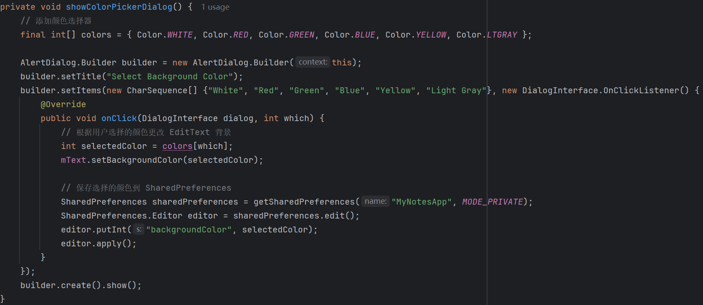

### 基本功能

#### 添加笔记时间戳

1. 发现在`NotePad.java`中已经定义了时间戳常量
   

2. 在游标适配器所需的列所在数组中多添加一个时间戳常量
   

3. 给要绑定到视图的列中添加时间戳常量
   

4. 将要显示游标列的视图ID，初始化为`noteslist_item.xml` 中的 `TextView`
   

   `noteslist_item.xml`：
   
   ```xml
   <?xml version="1.0" encoding="utf-8"?>
   <LinearLayout xmlns:android="http://schemas.android.com/apk/res/android"
       android:orientation="vertical"
       android:layout_width="match_parent"
       android:layout_height="match_parent">
   
       <TextView
           android:id="@+id/textTitle"
           android:layout_width="match_parent"
           android:layout_height="wrap_content"
           android:text="TextView" />
   
       <TextView
           android:id="@+id/textDate"
           android:layout_width="match_parent"
           android:layout_height="wrap_content"
           android:text="TextView"
           android:gravity="end" />
   </LinearLayout>
   ```

6. 最终呈现的结果为一整串数字，所以要将这串数字装为正确的日期格式，这里通过内部类来实现
   
   
   最终的效果：
   
   

#### 添加笔记查询功能

1. 实现`searchNotes()`方法用于在数据库中模糊查找笔记的标题
   

2. 在`NotesList.java` 的 `OnCreat()`中添加新的布局文件`search_view.xml`（在`res/layout`中新建`search_view.xml`布局文件）
   
   ```xml
   <?xml version="1.0" encoding="utf-8"?>
   <RelativeLayout xmlns:android="http://schemas.android.com/apk/res/android"
       android:layout_width="match_parent"
       android:layout_height="match_parent">
   
       <SearchView
           android:id="@+id/search_view"
           android:layout_width="match_parent"
           android:layout_height="wrap_content"
           android:iconifiedByDefault="false"
           android:queryHint="搜索笔记" />
   
       <ListView
           android:id="@android:id/list"
           android:layout_width="match_parent"
           android:layout_height="match_parent"
           android:layout_below="@id/search_view" />
   
   </RelativeLayout>
   ```

3. 设置搜索视图，根据用户的输入实时更新笔记列表
   
   后面新增了改变搜索框文本颜色的代码

4. 效果呈现：

   
   

---

### 扩展功能

#### 添加修改笔记背景颜色的功能

1. ###### 更新菜单资源：
   
   <1>在 `res/menu/editor_options_menu.xml` 中，添加一个用于修改背景颜色的菜单项
   <2>同时，在 `res/values/strings.xml` 中添加字符串资源

2. ###### 更新 `onOptionsItemSelected` 方法
   
   在 `NoteEditor` 类中，处理新菜单项的选择。在 `onOptionsItemSelected` 中添加相应的代码
   
   
   实现 `showColorPickerDialog` 方法
   
   这样修改后，颜色无法保存，重新打开笔记后，颜色又恢复默认，改进：使用 `SharedPreferences` 来实现这一点
   修改`showColorPickerDialog`方法：
   
   > `SharedPreferences` 是 Android 提供的一种轻量级的数据存储方式，非常适合存储一些简单的键值对数据，例如用户设置、应用状态、以及小型数据等。
   
   
   在 `onCreate` 方法添加代码从 `SharedPreferences` 中读取存储的颜色，并设置到 `EditText` 的背景中。
   
   这样就能实现修改并保存背景颜色的功能
   
   > `Color` 类提供了一些预定义的颜色常量（前面用到的颜色有的太亮，不太友好），但这样后面添加新颜色比较麻烦，使用修改为用color.xml中定义的颜色，这样颜色的选择比较多样，修改也比较方便

4. 使用color.xml来代替Color类
   
   > `Color` 类提供了一些预定义的颜色常量（前面用到的颜色有的太亮，不太友好），但这样后面添加新颜色比较麻烦，使用修改为用color.xml中定义的颜色，这样颜色的选择比较多样，修改也比较方便
   
   在`res/value`中新建一个color.xml，加入想要的颜色
   

   修改colors数组和显示文本
   
   

6. 效果展示：
   
   
   
   
   选择LightGreen
   
   

#### UI美化

##### 笔记列表项视图美化

列表项圆角背景（首先在 `res/drawable` 目录下创建一个名为 `rounded_background.xml` 的文件）

```xml
<!-- res/drawable/rounded_background.xml -->
<shape xmlns:android="http://schemas.android.com/apk/res/android"
    android:shape="rectangle">
    <solid android:color="@color/white" /> <!-- 背景颜色 -->
    <corners android:radius="18dp" /> <!-- 设置圆角半径 -->
    <padding
        android:left="8dp"
        android:top="8dp"
        android:right="8dp"
        android:bottom="8dp" /> <!-- 内边距 -->
</shape>
```

修改`noteslist_item.xml`

<?xml version="1.0" encoding="utf-8"?>

```xml
<?xml version="1.0" encoding="utf-8"?>
<LinearLayout xmlns:android="http://schemas.android.com/apk/res/android"
    android:orientation="vertical"
    android:layout_width="match_parent"
    android:layout_height="wrap_content"
    android:padding="4dp">

    <LinearLayout
        android:orientation="vertical"
        android:layout_width="match_parent"
        android:layout_height="wrap_content"
        android:layout_marginBottom="1dp"
        android:background="@drawable/rounded_background"
        android:clipToPadding="false"
        android:elevation="2dp"
        android:padding="8dp">

        <TextView
            android:id="@+id/textTitle"
            android:layout_width="match_parent"
            android:layout_height="wrap_content"
            android:layout_marginBottom="8dp"
            android:text="Title TextView"
            android:textColor="@android:color/black"
            android:textSize="20sp"
            android:textStyle="bold" />

        <TextView
            android:id="@+id/textDate"
            android:layout_width="match_parent"
            android:layout_height="wrap_content"
            android:gravity="end"
            android:text="Date TextView"
            android:textColor="@android:color/background_dark"
            android:textSize="12sp" />
    </LinearLayout>

</LinearLayout>
```

前后对比：


后续新增：（修改标题栏，并更换了图标）
在 `res/values` 目录下创建一个名为 `styles.xml` 的文件（这里可以设置标题栏的背景颜色还有文本颜色）

<?xml version="1.0" encoding="utf-8"?>

```xml
  <resources>  
    <style name="MyCustomTheme" parent="@android:style/Theme.Holo.Light">  
        <item name="android:actionBarStyle">@style/MyActionBar</item>  
        <item name="android:colorBackground">@android:color/white</item>  
    </style>  
    <style name="MyActionBar" parent="@android:style/Widget.Holo.ActionBar">  
        <item name="android:background">@color/LightSkyBlue</item> <!-- 设置标题栏背景为天空蓝 -->  
        <item name="android:titleTextStyle">@style/MyActionBarTitleText</item>  
    </style>  
    <style name="MyActionBarTitleText" parent="@android:style/TextAppearance.Holo.Widget.ActionBar.Title">  
        <item name="android:textColor">@android:color/black</item> <!-- 设置标题文本颜色为黑色 -->  
        <item name="android:textSize">20sp</item> <!-- 可调整标题文字大小 -->  
        <item name="android:fontFamily">sans-serif-medium</item> <!-- 设置字体 → 可以更改为其他字体 -->  
    </style>  

    <style name="AppTheme">  
        <item name="android:fontFamily">sans-serif-medium</item>  
        <item name="android:actionBarStyle">@style/MyActionBar</item>  
    </style></resources>
```

在`AndroidManifest.xml`中修改`NoteList.java`和`NoteEditor.java`的主题`Theme`


修改后：


##### 搜索框美化

自定义搜索框背景样式文件`search_view_background.xml`：

```xml
<?xml version="1.0" encoding="utf-8"?>
<shape xmlns:android="http://schemas.android.com/apk/res/android">
    <corners android:radius="18dp" /> <!-- 圆角半径 -->
    <solid android:color="#FFFFFF" />   <!-- 背景色 -->
    <padding
        android:left="16dp"
        android:right="16dp"
        android:top="8dp"
        android:bottom="8dp" />
</shape>
```

修改`note_search_list.xml`：

<?xml version="1.0" encoding="utf-8"?>

```xml
<?xml version="1.0" encoding="utf-8"?>
<LinearLayout xmlns:android="http://schemas.android.com/apk/res/android"
    android:layout_width="match_parent"
    android:layout_height="match_parent"
    android:orientation="vertical"
    android:padding="0dp">

    <RelativeLayout
        android:layout_width="match_parent"
        android:layout_height="1dp"
        android:layout_weight="1"
        android:padding="4dp">

        <android.widget.SearchView
            android:id="@+id/search_view"
            android:layout_width="match_parent"
            android:layout_height="wrap_content"
            android:iconifiedByDefault="false"
            android:queryHint="@null"
            android:background="@drawable/search_view_background"
            android:padding="10dp"
            android:searchIcon="@drawable/ic_menu_select_black" />

        <ListView
            android:id="@android:id/list"
            android:layout_width="match_parent"
            android:layout_height="match_parent"
            android:layout_below="@id/search_view" />

    </RelativeLayout>

</LinearLayout>
```

前后对比：（后面还替换了图标）


##### 笔记编辑界面美化

在 `res/drawable` 目录下创建一个名为 `edit_text_background.xml` 的文件

```xml
<shape xmlns:android="http://schemas.android.com/apk/res/android">
    <solid android:color="@android:color/white"/> <!-- 设置背景色 -->
    <corners android:radius="16dp"/> <!-- 设置圆角 -->
</shape>
```

修改`note_editor.xml`

```xml
<?xml version="1.0" encoding="utf-8"?>
<LinearLayout xmlns:android="http://schemas.android.com/apk/res/android"
    android:layout_width="match_parent"
    android:layout_height="match_parent"
    android:orientation="vertical"
    android:padding="12dp"
    android:gravity="top|start">

    <!-- 包含自定义的 LinedEditText 控件 -->
    <view
        xmlns:android="http://schemas.android.com/apk/res/android"
        android:id="@+id/note"
        class="com.example.android.notepad.NoteEditor$LinedEditText"
        android:layout_width="match_parent"
        android:layout_height="match_parent"
        android:background="@drawable/edit_text_background"
        android:capitalize="sentences"
        android:fadingEdge="vertical"
        android:gravity="top|start"
        android:scrollbars="vertical"
        android:textSize="22sp"
        android:padding="10dp" /> <!-- 设置内边距 -->

</LinearLayout>
```

修改`NoteEditor.java`中的`OnCreate()`方法 
 

展示：


#### 添加笔记导出功能

1. 在 `res/menu/editor_options_menu.xml` 文件中，添加一个新的菜单项
   

2. 在 `onOptionsItemSelected` 方法的 switch 语句中处理导出操作：
   

3. 实现`exportNote`方法：
   

<?xml version="1.0" encoding="utf-8"?>

<?xml version="1.0" encoding="utf-8"?>

---

### 更新SDK后


报错问题解决（`AndroidManifest.xml`）：
给定义了意图过滤器（`intent filter`）的组件（`activity`）设置 `android:exported` 属性


更新后页面展示：


#### 添加字体样式修改功能

1. 右键点击 `main` 文件夹：在 `main` 文件夹上右键点击，选择 `New -> Folder`。 选择 `Assets Folder`，然后点击 `Finish`。这样就会在 `src/main` 创建一个 `assets` 文件夹。 在 `assets` 文件夹中创建一个`fonts`文件夹，在里面添加字体文件（字体文件下载地址<格式：.ttf>：[Browse Fonts - Google Fonts](https://fonts.google.com/?preview.text=%E4%BD%A0%E5%A5%BD)）

   

3. 添加一个菜单项用来显示修改字体样式（`onOptionsItemSelected()`方法）
   
   

5. 编写一个方法<`showFontOptionsDialog()`>来生成一个对话框来选择字体样式并修改
   

   `setCustomFont()`方法：
   
   

##### 添加字体样式后不能保存——解决（没解决）

1. 修改数据库结构
   在 `NotePadProvider` 类中修改数据库表的结构，以添加新的列来存储字体样式。
   

2. 更新 `NotePad` 类的定义
   

3. 更新 `insert` 和 `update` 方法

   `insert`方法
   
   

   `update`方法
   
   

5. 在 UI 中保存和加载字体样式
   
   


